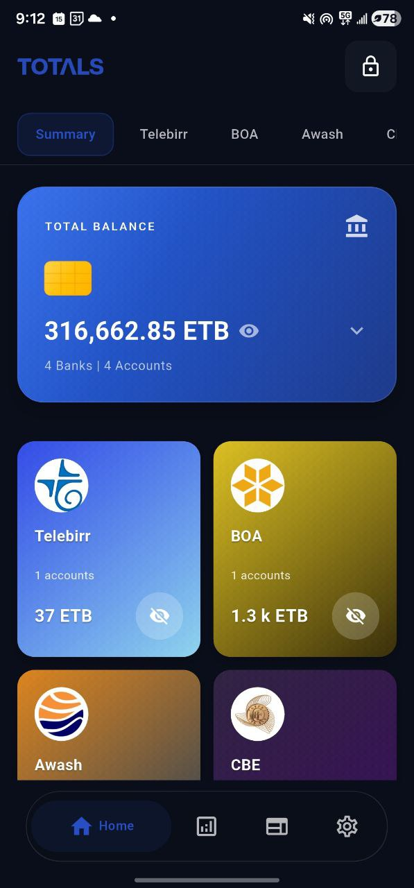
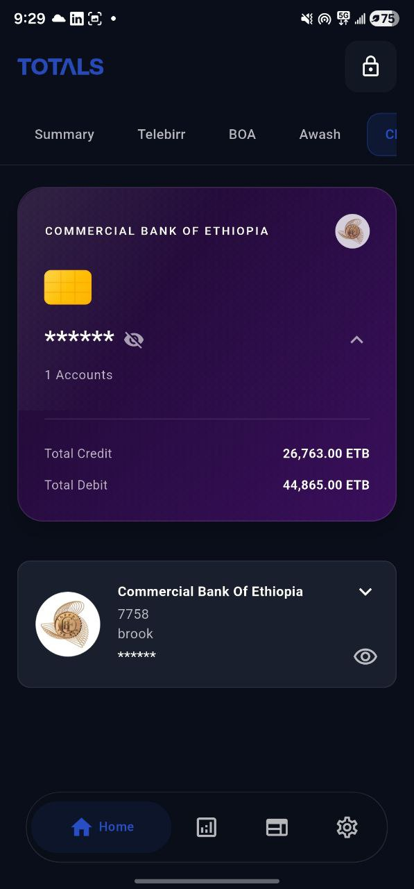
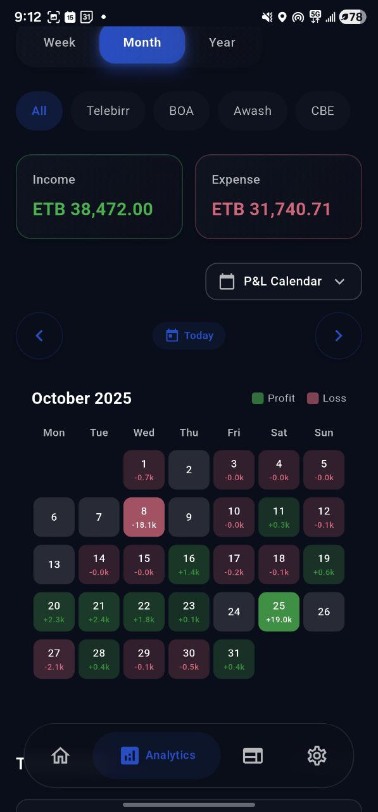
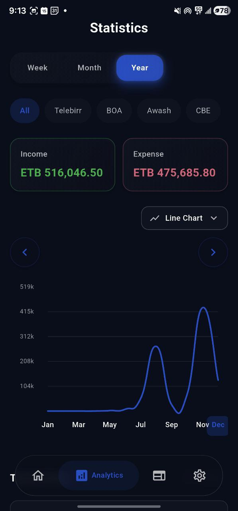
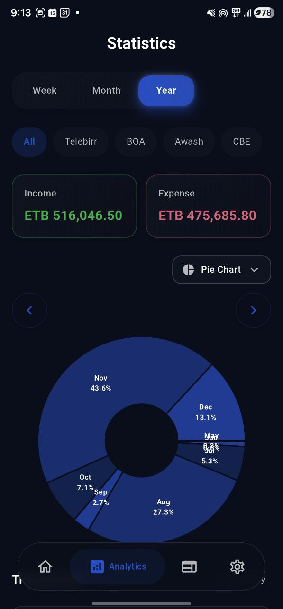
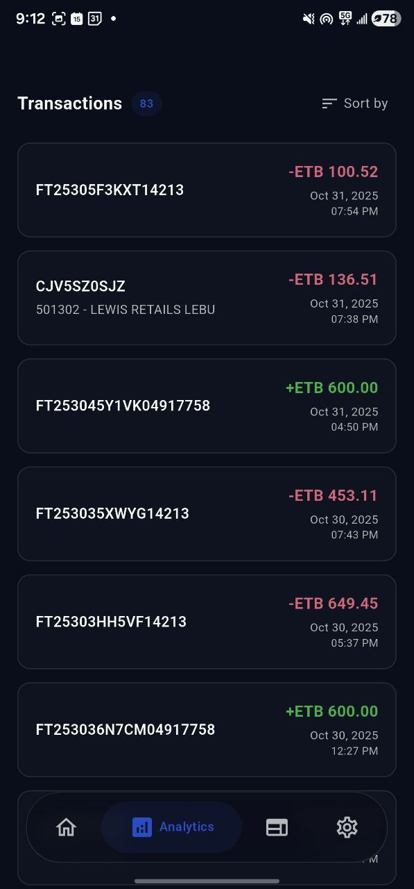

# Totals

**Totals** is a Flutter mobile application that automatically tracks your bank transactions by parsing SMS messages from Ethiopian banks. It provides real-time balance updates, transaction history, analytics, and comprehensive financial insights all stored securely on your device.

## Screenshots

<div align="center">
  
  
  
</div>

<div align="center">
  
  
  
</div>

## Features

### 🏦 Multi-Bank Support
- **Commercial Bank of Ethiopia (CBE)**
- **Awash Bank**
- **Bank of Abyssinia (BOA)**
- **Dashen Bank**
- **Telebirr**

### 📱 Core Functionality

- **Automatic SMS Parsing**: Monitors incoming SMS messages from banks and automatically extracts transaction details
- **Real-Time Balance Updates**: Account balances are updated automatically when transactions are detected
- **Transaction History**: Complete history of all transactions with filtering and search capabilities
- **Account Management**: Add and manage multiple bank accounts
- **Analytics Dashboard**: Visual charts and insights including:
  - Income vs Expense tracking
  - Net worth over time
  - Spending patterns by period (Day, Week, Month, Year)
  - Transaction statistics by bank and account
- **Biometric Security**: Protect your financial data with fingerprint or face authentication
- **Dark/Light Theme**: Beautiful Material Design 3 interface with theme support
- **Local Web Server**: Built-in HTTP server to access your data from a web browser on the same network

### 🔒 Privacy & Security

- **100% Local Storage**: All data is stored locally on your device using SQLite
- **No Cloud Sync**: Your financial data never leaves your device
- **Biometric Authentication**: Secure access with fingerprint or face recognition
- **Offline-First**: Works completely offline after initial setup

## Getting Started

### Prerequisites

- Flutter SDK (>=3.2.6)
- Dart SDK
- Android Studio / Xcode (for mobile development)
- Android device/emulator or iOS device/simulator

### Installation

1. **Clone the repository**
   ```bash
   git clone <repository-url>
   cd totals/app
   ```

2. **Install dependencies**
   ```bash
   flutter pub get
   ```

3. **Run the app**
   ```bash
   flutter run
   ```

### First-Time Setup

1. **Grant SMS Permissions**: The app will request permission to read SMS messages. This is required to monitor bank transaction notifications.

2. **Add Your First Account**:
   - Tap the "Add Account" button on the home screen
   - Enter your account details:
     - Account number
     - Bank selection
     - Account holder name
   - The app will start tracking transactions for this account automatically

3. **Initial Internet Connection**: On first launch, the app may need internet access to download SMS parsing patterns. After this, it works completely offline.

## Usage

### Adding Accounts

1. Navigate to the home screen
2. Tap "Add Account" (or the + button if accounts already exist)
3. Fill in the account details form
4. Submit to save the account

### Viewing Transactions

- **Home Tab**: View all accounts and their balances
- **Bank Tabs**: Filter transactions by specific bank
- **Analytics Tab**: View charts and statistics
- **Transactions List**: Scroll through all transactions with filtering options

### Analytics

The Analytics page provides:
- **Time Period Selection**: Day, Week, Month, Year views
- **Chart Types**: Profit & Loss calendar, line charts, and more
- **Filtering**: Filter by bank, account, or transaction type
- **Income/Expense Breakdown**: Visual representation of your spending patterns

### Web Access

1. Navigate to the "Web" tab in the app
2. Start the local server
3. Access the web interface from any device on the same network using the displayed IP address
4. The web interface provides a full-featured dashboard for viewing your financial data

### Security

- **Lock App**: Tap the lock icon in the app bar to lock the app
- **Biometric Authentication**: Enable biometric authentication in settings for automatic locking
- **Auto-Lock**: The app locks automatically when minimized

## Architecture

### Project Structure

```
lib/
├── auth-service.dart          # Authentication service
├── main.dart                  # App entry point
├── components/                # Reusable UI components
├── data/
│   └── consts.dart            # Bank definitions and constants
├── database/
│   ├── database_helper.dart   # SQLite database setup
│   └── migration_helper.dart  # Database migrations
├── local_server/              # HTTP server for web access
│   ├── handlers/              # API route handlers
│   ├── server_service.dart    # Main server implementation
│   └── network_utils.dart     # Network utilities
├── models/                    # Data models
│   ├── account.dart
│   ├── transaction.dart
│   ├── sms_pattern.dart
│   └── summary_models.dart
├── providers/                 # State management (Provider)
│   ├── transaction_provider.dart
│   └── theme_provider.dart
├── repositories/              # Data access layer
│   ├── account_repository.dart
│   └── transaction_repository.dart
├── screens/                   # Main app screens
│   ├── home_page.dart
│   ├── analytics_page.dart
│   ├── web_page.dart
│   └── settings_page.dart
├── services/                  # Business logic services
│   ├── sms_service.dart       # SMS monitoring and parsing
│   └── sms_config_service.dart
├── sms_handler/               # SMS processing logic
├── utils/                     # Utility functions
└── widgets/                   # UI widgets
```

### Key Components

#### SMS Service
- Monitors incoming SMS messages in foreground and background
- Identifies bank messages using sender address patterns
- Parses transaction details using regex patterns
- Updates account balances automatically
- Stores transactions in local database

#### Local Server
- Built with Shelf framework
- Serves REST API endpoints for web frontend
- Provides endpoints for:
  - Accounts (`/api/accounts`)
  - Transactions (`/api/transactions`)
  - Banks (`/api/banks`)
  - Summary (`/api/summary`)
  - Analytics (`/api/analytics/*`)

#### Database
- SQLite database for local storage
- Tables: accounts, transactions, failed_parses
- Automatic migrations for schema updates

## API Documentation

The app includes a local HTTP server that exposes REST API endpoints. See:
- `lib/local_server/ENDPOINT_GUIDE.md` - Guide for creating new endpoints
- `API_IMPLEMENTATION_PLAN.md` - Complete API specification

### Example Endpoints

- `GET /api/accounts` - List all accounts
- `GET /api/transactions` - List transactions with filtering
- `GET /api/summary` - Get aggregated summary
- `GET /api/banks` - List supported banks

## Development

### Running Tests

```bash
flutter test
```

### Building for Production

**Android:**
```bash
flutter build apk --release
```

**iOS:**
```bash
flutter build ios --release
```

### Debugging

The app includes debug tools accessible from the home screen:
- **SMS Debug Dialog**: View recent SMS messages
- **Transactions Debug Dialog**: View all stored transactions
- **Failed Parse Dialog**: View SMS messages that couldn't be parsed

## Dependencies

Key dependencies include:
- `provider` - State management
- `sqflite` - Local SQLite database
- `another_telephony` - SMS monitoring
- `shelf` - HTTP server framework
- `local_auth` - Biometric authentication
- `fl_chart` - Chart visualization
- `shared_preferences` - Local settings storage

See `pubspec.yaml` for the complete list.

## Troubleshooting

### SMS Not Being Detected

1. Ensure SMS permissions are granted
2. Check that the sender address matches bank codes in `lib/data/consts.dart`
3. View failed parses in the debug dialog to see what's happening

### Account Balance Not Updating

1. Verify the account number matches the one in SMS messages
2. Check that SMS parsing patterns are correct for your bank
3. Some banks may require different account matching logic

### Web Server Not Starting

1. Ensure your device and computer are on the same network
2. Check firewall settings
3. Verify the IP address displayed in the Web tab

## Contributing

Contributions are welcome! Please:
1. Fork the repository
2. Create a feature branch
3. Make your changes
4. Submit a pull request

## License

[Specify your license here]

## Support

For issues, questions, or feature requests, please open an issue on the repository.

---

**Note**: This app requires SMS reading permissions to function. All data is stored locally and never transmitted to external servers. The app is designed specifically for Ethiopian banks and their SMS notification formats.
